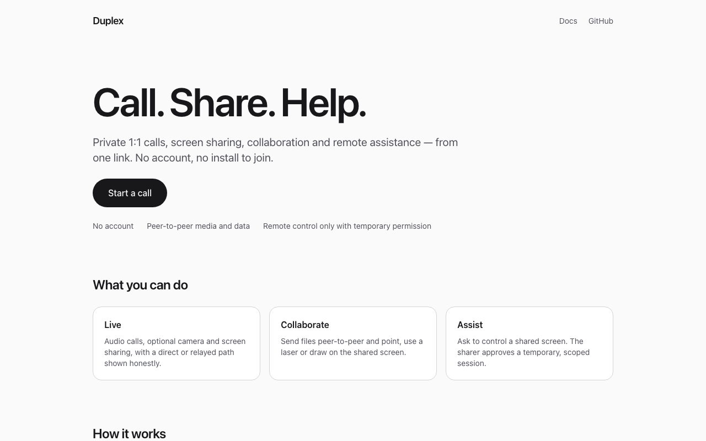
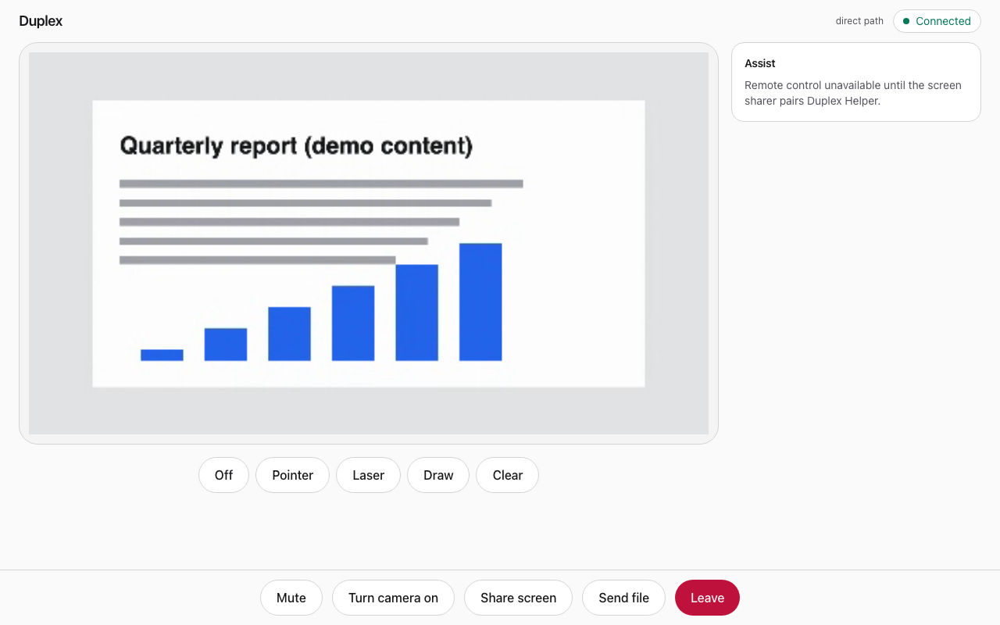
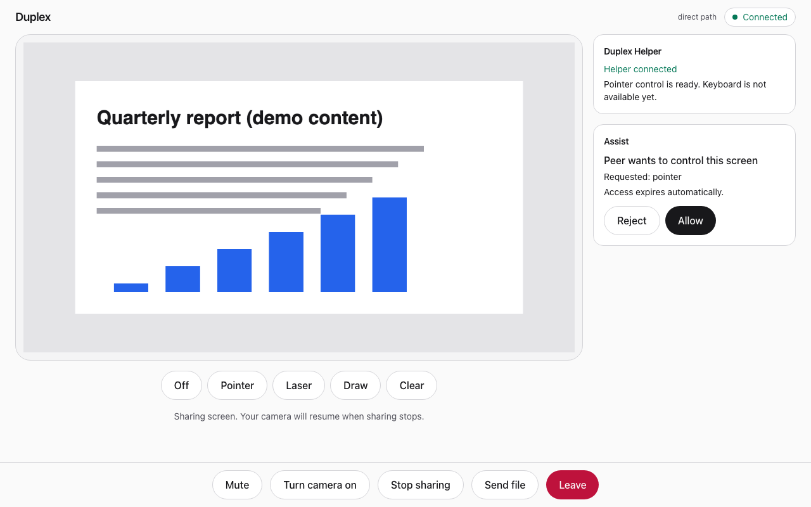
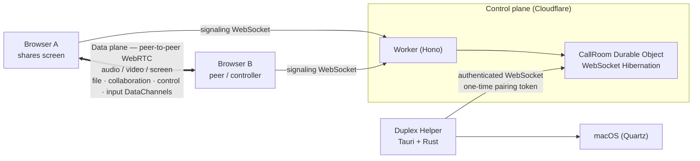

<div align="center">

# Duplex

**Private 1:1 calls, screen sharing, collaboration and remote assistance — from one link.**

_Call. Share. Help._

[](https://github.com/Andersseen/Duplex/actions/workflows/ci.yml)
[](https://github.com/Andersseen/Duplex/actions/workflows/security.yml)




</div>

## What is Duplex?

Duplex is a small, private way to talk to one person and help them. You create a link, send it, and the
two of you can talk, share a screen, send files, point at things, and — if the person sharing allows
it — move their mouse. There are no accounts, no installs to join a call, and nothing is stored after
it ends.

## Why Duplex?

Most call tools assume a meeting. Duplex assumes a **conversation that sometimes needs hands**: a
relative stuck in settings, a colleague with a bug on their machine. It keeps the parts that matter
(a direct connection, a link that is the whole invitation) and puts consent in front of the
powerful part (remote control): temporary, scoped, and revocable by either side.

## What works today

| Area                      | State                                                                                   |
| ------------------------- | --------------------------------------------------------------------------------------- |
| 1:1 audio, camera, screen | Working. Direct WebRTC with Cloudflare STUN and TURN relay fallback, ICE recovery.      |
| Connection diagnostics    | Direct vs relay path reported (development builds show it in the header).               |
| File transfer             | Working. Peer-to-peer, receiver accepts each file, up to 256 MiB, no server storage.    |
| Screen collaboration      | Working. Pointer, laser and drawing over the shared screen.                             |
| Assist consent flow       | Working. Request → explicit Allow → temporary scoped session, revocable by either side. |
| Native pointer control    | **Experimental, macOS only.** Move, click, drag and scroll through the paired helper.   |
| Keyboard control          | **Not implemented.**                                                                    |
| Windows / Linux control   | **Not implemented.** The helper pairs but never advertises a native capability.         |

Duplex is not a TeamViewer or AnyDesk replacement: it has no unattended access, no persistent
pairing, no multi-user rooms, no chat, no recording and no clipboard sync.

<p align="center">
  
  
</p>

> Screenshots are real renderings of the app with a synthetic shared screen. Regenerate them with
> `pnpm docs:screenshots` (see [Testing](./docs/testing.md#regenerating-screenshots)).

## Quick start

Prerequisites: Node `>=22.22.3` (see `.nvmrc`) and pnpm 10 (`corepack enable`). Rust and the
[Tauri prerequisites](https://v2.tauri.app/start/prerequisites/) are only needed for the native helper.

```bash
pnpm install
pnpm dev            # web on http://localhost:5173 + signaling Worker on http://localhost:8787
```

Open the app in two browser windows: **Start a call** in one, paste the link into the other.
Real TURN relay and production deployment are covered in [DEPLOYMENT.md](./DEPLOYMENT.md).

## Features

- **Live** — audio-first calls, opt-in camera, screen sharing, mute, perfect negotiation, ICE restart.
- **Collaborate** — P2P file transfer with consent; pointer, laser and annotations bound to the shared screen.
- **Assist** — a consent protocol for remote control, plus an optional native helper that performs it on macOS.
- **Private by construction** — anonymous 128-bit room links, two participants per room, media and file bytes never touch the server.

## Platform support

| Platform | Browser calling                | Native pointer control       | Native keyboard control |
| -------- | ------------------------------ | ---------------------------- | ----------------------- |
| macOS    | Modern Chromium-based browsers | **Supported** (experimental) | Not yet                 |
| Windows  | Modern Chromium-based browsers | Not yet                      | Not yet                 |
| Linux    | Modern Chromium-based browsers | Not yet                      | Not yet                 |

Automated tests run in Chromium. Other engines are best effort. Native pointer control needs an
**entire monitor** share, a paired helper, macOS Accessibility permission and an explicit Allow
(details in [docs/assist.md](./docs/assist.md)).

## Architecture



The **control plane** (Worker + Durable Object) only admits two
participants, relays offer/answer/ICE, issues short-lived TURN credentials and routes helper
messages to the participant that owns the helper. The **data plane** is peer-to-peer WebRTC; when
NAT blocks a direct path, TURN relays _encrypted_ traffic. Cloudflare does not store or inspect
media or file contents. See [docs/architecture.md](./docs/architecture.md).

## Security model

- A room link is an **anonymous 128-bit capability**; rooms hold at most two people and exist only while occupied.
- WebSocket origins are validated; TURN keys stay in Worker secrets and only short-lived credentials reach browsers.
- Helper pairing uses a **256-bit, two-minute, one-use** token; only its SHA-256 hash is kept server-side.
- The native helper **re-validates every input event** itself (session, surface, scope, expiry, sequence, rate, Accessibility, display).
- **No unattended access**: no saved credentials, no always-allow, no background start.

Full detail and threat model: [docs/security.md](./docs/security.md). To report a vulnerability see [SECURITY.md](./SECURITY.md).

## Assist trust model

Pairing identifies _your_ helper; it grants nothing. Control needs the peer's request **and** your
explicit Allow, scoped to the screen you are sharing, expiring automatically, and revocable from
either browser or the helper. Pointer permission is not keyboard permission, and browser
collaboration (pointer/laser/draw) is not native control. See [docs/assist.md](./docs/assist.md).

## Development

```bash
pnpm dev              # web + Worker
pnpm dev:helper       # native helper (Tauri)
pnpm format:check && pnpm lint && pnpm typecheck
pnpm test             # fast unit/component/integration tests
pnpm test:coverage    # same tests with enforced coverage thresholds
pnpm build
```

Repository layout, conventions and the branch workflow are in [CONTRIBUTING.md](./CONTRIBUTING.md).

## Testing

Vitest (protocol, WebRTC, services), Angular Testing Library (components), Cloudflare's Vitest
integration (Worker + Durable Object), `cargo test` (helper), and Playwright (real Chromium E2E,
accessibility with axe, production-header verification). Real native macOS input cannot be posted
from CI and is verified manually.

```bash
pnpm test:coverage    # per-package thresholds
pnpm e2e              # browser E2E + accessibility
pnpm e2e:production   # production build with its real security headers
```

See [docs/testing.md](./docs/testing.md) for the test pyramid, thresholds and manual macOS checklist.

## Deployment

Two Cloudflare Workers (`apps/worker` signaling + Durable Object, `apps/web` Analog SSR app).
Step-by-step instructions, required secrets and the forced-relay check are in
[DEPLOYMENT.md](./DEPLOYMENT.md). GitHub repository settings worth enabling are listed in
[docs/repository-settings.md](./docs/repository-settings.md).

## Project structure

```text
apps/web           Analog.js + Angular 22 browser app
apps/worker        Cloudflare Worker (Hono) and the CallRoom Durable Object
apps/helper        Tauri 2 + Angular UI and the Rust-owned helper WebSocket / native input
packages/protocol  Zod wire schemas, room IDs, pairing bundles (no framework)
packages/webrtc    Browser WebRTC peer and DataChannel wrappers (no framework)
packages/config    Shared TypeScript and ESLint configuration
docs/              Architecture, security, testing, Assist, roadmap
e2e/               Playwright suites
```

## Roadmap

Live, file transfer, collaboration, the Assist consent flow and macOS pointer control are done.
Next is macOS keyboard control; Windows/Linux helpers and capture are later and unscheduled. See
[docs/roadmap.md](./docs/roadmap.md).

## Contributing

Contributions are welcome — read [CONTRIBUTING.md](./CONTRIBUTING.md) first, especially for
security-sensitive areas (pairing, control sessions, native input). Please follow the
[Code of Conduct](./CODE_OF_CONDUCT.md).

## License status

Duplex has **not yet selected a license**; the packages are marked `UNLICENSED`, which means all
rights are reserved by the author for now. Choosing a license is an open owner decision. Until then,
please open an issue before depending on or redistributing the code.
