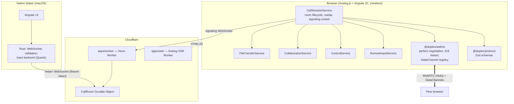
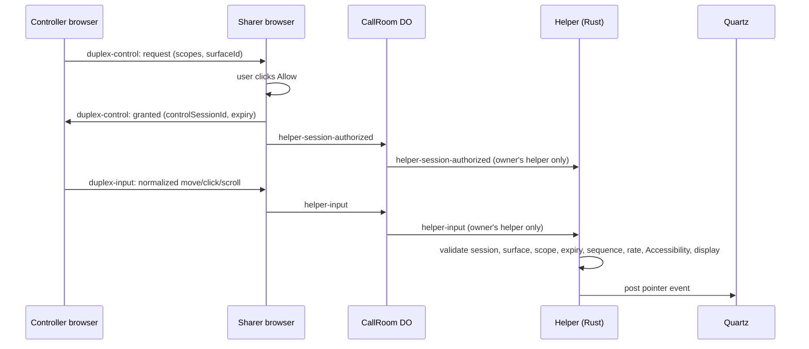

# Architecture

Duplex is a pnpm + Turborepo monorepo with two deployable Cloudflare Workers, one native helper and
two framework-free packages. This page describes what is implemented today.

## System overview

## Ownership boundaries

| Unit                | Owns                                                                                              | Must not                                  |
| ------------------- | ------------------------------------------------------------------------------------------------- | ----------------------------------------- |
| `packages/protocol` | Wire schemas, protocol versions, room ID format, helper pairing bundle, size and rate limits      | Depend on a framework or the DOM          |
| `packages/webrtc`   | `RTCPeerConnection` wrapper: perfect negotiation, ICE recovery, path stats, labelled DataChannels | Know about Angular, rooms or UI           |
| `apps/web`          | UI, the browser-side domain services below, the signaling WebSocket adapter                       | Put protocol or media logic in components |
| `apps/worker`       | Origin checks, room routing, `CallRoom`, TURN credential issuance, helper routing                 | Touch media, file bytes or input contents |
| `apps/helper`       | Pairing UI; Rust-owned helper socket, validation and the native input backend                     | Trust the browser or the network          |

Apps never import from other apps. Everything shared lives in `packages/*`.

### Browser services (`apps/web/src/app/services`)

- **`CallSessionService`** — join/leave lifecycle, microphone/camera/screen capture, signaling socket,
  peer creation, TURN credential refresh, helper pairing state. Provided per room page.
- **`FileTransferService`** — framing, consent, progress and cancellation over `duplex-file-transfer`.
- **`CollaborationService`** — pointer, laser and strokes bound to the shared-screen surface.
- **`ControlService`** — the Assist consent state machine over `duplex-control`: request, allow/reject,
  expiry, revoke, surface binding and helper capability.
- **`RemoteInputService`** — turns controller gestures into validated, rate-limited, sequence-numbered
  normalized input over `duplex-input`.

Components are presentation only. Small presentational pieces live in `ui/` (`ControlButton`,
`StatusBadge`, `Panel`) and room panels in `room/`; they read state from the services.

## Signaling and rooms

The Worker validates the opaque 128-bit room ID and resolves the Durable Object with
`idFromName(roomId)`. `CallRoom`:

- admits at most two participants and assigns complementary `polite`/`impolite` roles;
- relays offer, answer and ICE only to the other participant;
- sends each joined participant temporary ICE servers, refreshing at most once a minute;
- uses **WebSocket Hibernation**; identity, pairing hash and limits live in serialized socket
  attachments so the object can hibernate and recover without a database.

A room exists only while its Durable Object is being addressed. There is no persistent room record.

## Media and data plane

WebRTC prefers a direct path. Cloudflare STUN helps direct setup; Cloudflare Realtime TURN relays
_encrypted_ traffic when NAT blocks it. The five DataChannels are created by the impolite peer with
purpose-specific delivery:

| Label                  | Delivery                  | Carries                                 |
| ---------------------- | ------------------------- | --------------------------------------- |
| `duplex-file-transfer` | reliable, ordered         | File offers, consent, chunks            |
| `duplex-collaboration` | reliable, ordered         | Media-source state, strokes, clear      |
| `duplex-pointer`       | unordered, no retransmits | Pointer / laser position                |
| `duplex-control`       | reliable, ordered         | Assist request / grant / revoke         |
| `duplex-input`         | reliable, ordered         | Normalized pointer input for the helper |

Camera and screen share one outgoing video sender (`replaceTrack`); starting a share replaces the
camera and stopping it resumes the camera when still enabled.

## Why it is built this way

**Media is not sent through the Worker.** A Worker is a request/response edge runtime, not a media
server; relaying media would add cost and latency, and make Cloudflare a party to the content.
WebRTC already provides encrypted peer-to-peer transport, with TURN as an encrypted last resort.

**File contents are not stored server-side.** Files travel over a DataChannel between the two
browsers. The receiver must accept each offer first, and the 256 MiB limit exists because the
receiver assembles the file in browser memory. Transfers cannot resume after a disconnect.

**Native input requires a helper.** Browsers cannot move the operating-system cursor. The helper is
a separate, narrowly-scoped native process that the user installs, pairs and grants OS permission to,
and that re-validates everything it is sent.

## Native helper

The Rust crate (`apps/helper/src-tauri`) owns the helper WebSocket, the pairing bundle decoder, the
protocol validation and an `input` module with a `NativeInput` backend. macOS uses
CoreGraphics/Accessibility through narrow `objc2` bindings; other platforms use a backend that never
advertises a capability, and tests use a fake backend. The Angular UI only displays state and sends
a few explicit commands (`connect_helper`, `select_display`, `request_accessibility`, `stop_control`, …).

## Web delivery

`apps/web` is an Analog SSR app built with Nitro's `cloudflare_module` preset. The landing route and
the call route are separate lazy chunks, and Angular Movement is loaded on demand only inside a
call, so the landing page ships none of the call or animation code. Production responses carry the
security headers described in [security.md](./security.md#web-security-headers).
