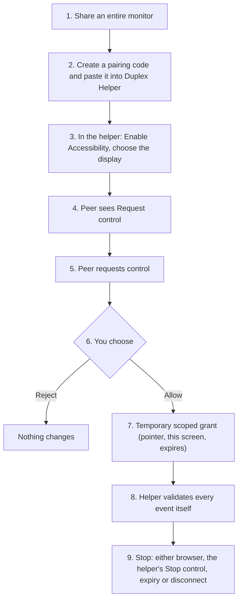

# Assist

Assist is Duplex's consent-based remote-help flow. This page explains the trust model; the protocol
and enforcement details are in [security.md](./security.md) and [architecture.md](./architecture.md).

> **Status: experimental.** Native pointer control works on macOS only. Keyboard control, clipboard,
> and Windows/Linux control are not implemented.

## Three different things

| This…                                            | …is not this                    | Why it matters                                                                                     |
| ------------------------------------------------ | ------------------------------- | -------------------------------------------------------------------------------------------------- |
| **Pairing** a helper                             | **Permission** to be controlled | Pairing only says "this helper belongs to this participant". It grants the peer nothing.           |
| **Pointer** permission                           | **Keyboard** permission         | Scopes are separate. Keyboard is not implemented, so it is never advertised, requested or granted. |
| **Browser collaboration** (pointer, laser, draw) | **Native control**              | Collaboration draws on the shared video in the browser; it never moves your real cursor.           |

## The flow

1. **Share a monitor.** The browser must report an entire monitor. Tab, window or unknown sources never qualify.
2. **Pair the helper.** Create a one-use, two-minute pairing code in the call and paste it into the helper.
3. **Prepare the Mac.** In the helper, click **Enable Accessibility** (the only way a prompt is ever shown), approve it in System Settings, **Re-check**, and — with several displays — pick the one you are sharing.
4. **Peer requests.** Only now does the peer see **Request control**, and only for scopes the helper can execute (currently `pointer`).
5. **You decide.** An alert dialog names the requested scope and says access expires. **Reject** changes nothing; **Allow** creates a grant.
6. **Temporary scoped grant.** The grant is tied to the current shared screen, carries its own session ID, and expires automatically (ten minutes at most).
7. **The helper independently validates input.** Session, screen, scope, expiry, ordering, rate, Accessibility and display are all checked again in Rust before any event is posted.
8. **Stop.** Either browser can release; the helper has its own **Stop control**; changing or ending the share, losing Accessibility or the display, expiry, or any disconnect also ends it — and releases any held mouse button.

## What the helper asks for

Only **Accessibility**. It needs no Screen Recording, Input Monitoring, microphone or camera
permission, because the browser captures the screen and the helper only posts pointer events.

## What Assist deliberately does not do

- No unattended access: no background start, saved credentials, persistent pairing or "always allow".
- No keyboard, clipboard or file-system access through the helper.
- No control of a window or tab share — only an entire monitor.
- No capability on Windows or Linux: the helper can pair there, but never advertises a scope.
